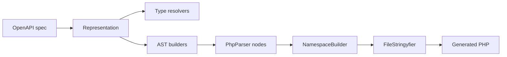

generator-utils
===============

Shared [nikic/php-parser](https://github.com/nikic/PHP-Parser) utilities for [OpenAPI Tools](https://github.com/php-openapi-tools) code generators: AST builders, type resolution, and file pretty-printing helpers consumed by packages such as [`generator-schema`](https://github.com/php-openapi-tools/generator-schema) and [`generator-hydrator`](https://github.com/php-openapi-tools/generator-hydrator).


[](https://packagist.org/packages/openapi-tools/generator-utils)
[](https://packagist.org/packages/openapi-tools/generator-utils/stats)
[](https://packagist.org/packages/openapi-tools/generator-utils)

Requirements
------------

- PHP `^8.4`

Installation
------------

```
composer require openapi-tools/generator-utils
```

Where it fits
-------------

Generator packages assemble PHP source with PhpParser nodes instead of string templates. This library provides the shared building blocks they all rely on: expression and statement factories, match-arm helpers, namespace file wrapping, OpenAPI type resolution, and final pretty-printing.



Components
----------

| Class | Purpose |
| --- | --- |
| `FileStringyfier` | Pretty-print AST `File` contents with `strict_types` |
| `Builder\DocBlockBuilder` | Format PHPDoc blocks from line arrays |
| `Builder\ExpressionBuilder` | Common AST expressions (`var`, `thisMethod`, `identical`, `andAll`, …) |
| `Builder\StatementBuilder` | Common AST statements (`assign`, `yieldMapOverIterable`, …) |
| `Builder\MatchBuilder` | Build `match` expressions on variables or class name strings |
| `Builder\HydrationBuilder` | Generate `$hydrator->hydrate($class, $data)`-style calls |
| `Builder\NamespaceBuilder` | Wrap class nodes in namespace `File` objects |
| `Type\UnionTypeUtils` | Resolve OpenAPI union types to PHP type strings |
| `Type\PropertyTypeResolver` | Resolve schema property types and docblock lines |

Examples
--------

Each builder renders AST nodes or PHPDoc strings that generators embed in emitted PHP:
PropertyTypeResolver
--------------------

Resolving OpenAPI property types from the `basic` schema yields these PHPDoc lines:
```php
use OpenAPITools\Generator\Utils\Type\DocBlockTag;
use OpenAPITools\Generator\Utils\Type\PropertyTypeResolver;

$resolved = PropertyTypeResolver::resolve($property, DocBlockTag::Property);
$resolved->docBlockLine;
```
**Rendered:**
```php
@property string $id
@property string $name
```
DocBlockBuilder
---------------

`DocBlockBuilder::fromLines()` turns those lines into a PHPDoc block:
```php
use OpenAPITools\Generator\Utils\Builder\DocBlockBuilder;

DocBlockBuilder::fromLines([
    '@property string $id',
    '@property string $name',
]);
```
**Rendered:**
```php
/**
 * @property string $id
 * @property string $name
 */
```
MatchBuilder and HydrationBuilder
---------------------------------

Routing hydration by class name produces a `match` expression with a hydrate call:
```php
use OpenAPITools\Generator\Utils\Builder\ExpressionBuilder;
use OpenAPITools\Generator\Utils\Builder\HydrationBuilder;
use OpenAPITools\Generator\Utils\Builder\MatchBuilder;
use PhpParser\Node\Expr;

MatchBuilder::onClassNameStrings('className', [
    [
        'classNames' => ['\ApiClients\Client\Example\Schema\Basic'],
        'body' => HydrationBuilder::hydrateCall(
            '\ApiClients\Client\Example\Schema\Basic',
            ExpressionBuilder::var('data'),
            ExpressionBuilder::var('hydrator'),
        ),
    ],
], new Expr\Throw_(ExpressionBuilder::newRuntimeException('Unknown schema')));
```
**Rendered:**
```php
return match ($className) {
    '\ApiClients\Client\Example\Schema\Basic' => $hydrator->hydrate(\ApiClients\Client\Example\Schema\Basic::class, $data),
    default => throw new \RuntimeException('Unknown schema'),
};
```
ExpressionBuilder
-----------------

Lazy property initialization as used by hydrator facades:
```php
use OpenAPITools\Generator\Utils\Builder\ExpressionBuilder;

ExpressionBuilder::lazyInitIfNotInstance(
    'operationRoot',
    '\ApiClients\Client\Example\Internal\Hydrator\Operation\Root',
);
ExpressionBuilder::returnProperty('operationRoot');
```
**Rendered:**
```php
if ($this->operationRoot instanceof \ApiClients\Client\Example\Internal\Hydrator\Operation\Root === false) {
    $this->operationRoot = new \ApiClients\Client\Example\Internal\Hydrator\Operation\Root();
}
return $this->operationRoot;
```
StatementBuilder
----------------

Mapping over iterables for batch hydrate/serialize helpers:
```php
use OpenAPITools\Generator\Utils\Builder\StatementBuilder;

StatementBuilder::yieldMapOverIterable(
    'payloads',
    'payload',
    'index',
    'hydrateObject',
    ['className', 'payload'],
);
```
**Rendered:**
```php
foreach ($payloads as $index => $payload) {
    yield $index => $this->hydrateObject($className, $payload);
}
```
NamespaceBuilder and FileStringyfier
------------------------------------

Wrapping a class node in a namespace `File` and pretty-printing with `strict_types`:
```php
use OpenAPITools\Generator\Utils\Builder\NamespaceBuilder;
use OpenAPITools\Generator\Utils\FileStringyfier;
use OpenAPITools\Utils\ClassString;
use PhpParser\BuilderFactory;
use PhpParser\PrettyPrinter\Standard;

$builderFactory = new BuilderFactory();
$namespaceBuilder = new NamespaceBuilder($builderFactory);
$classString = ClassString::factory($namespace, 'Internal\Example');
$classNode = $builderFactory->class($classString->className)->makeFinal()->getNode();
$file = $namespaceBuilder->classFile('src', $classString, $classNode);

new FileStringyfier(new Standard())->toString($file);
```
**Rendered:**
```php
<?php

declare (strict_types=1);
namespace ApiClients\Client\Example\Internal;

final class Example
{
}

```

Related packages
----------------

| Package | Relationship |
| --- | --- |
| [`representation`](https://github.com/php-openapi-tools/representation) | Input model for type resolution |
| [`gatherer`](https://github.com/php-openapi-tools/gatherer) | Builds the representation from OpenAPI |
| [`utils`](https://github.com/php-openapi-tools/utils) | `File`, `ClassString`, and namespace helpers |
| [`generator-schema`](https://github.com/php-openapi-tools/generator-schema) | Primary consumer — schema/contract/error generation |
| [`generator-hydrator`](https://github.com/php-openapi-tools/generator-hydrator) | Hydrator generator built on these utilities |
| [`generator`](https://github.com/php-openapi-tools/generator) | CLI and run loop that orchestrates all generators |

Contributing
------------

Please see [CONTRIBUTING](CONTRIBUTING.md) for details.

License
-------

The MIT License (MIT)

Copyright (c) 2026 Cees-Jan Kiewiet

Permission is hereby granted, free of charge, to any person obtaining a copy
of this software and associated documentation files (the "Software"), to deal
in the Software without restriction, including without limitation the rights
to use, copy, modify, merge, publish, distribute, sublicense, and/or sell
copies of the Software, and to permit persons to whom the Software is
furnished to do so, subject to the following conditions:

The above copyright notice and this permission notice shall be included in all
copies or substantial portions of the Software.

THE SOFTWARE IS PROVIDED "AS IS", WITHOUT WARRANTY OF ANY KIND, EXPRESS OR
IMPLIED, INCLUDING BUT NOT LIMITED TO THE WARRANTIES OF MERCHANTABILITY,
FITNESS FOR A PARTICULAR PURPOSE AND NONINFRINGEMENT. IN NO EVENT SHALL THE
AUTHORS OR COPYRIGHT HOLDERS BE LIABLE FOR ANY CLAIM, DAMAGES OR OTHER
LIABILITY, WHETHER IN AN ACTION OF CONTRACT, TORT OR OTHERWISE, ARISING FROM,
OUT OF OR IN CONNECTION WITH THE SOFTWARE OR THE USE OR OTHER DEALINGS IN THE
SOFTWARE.

